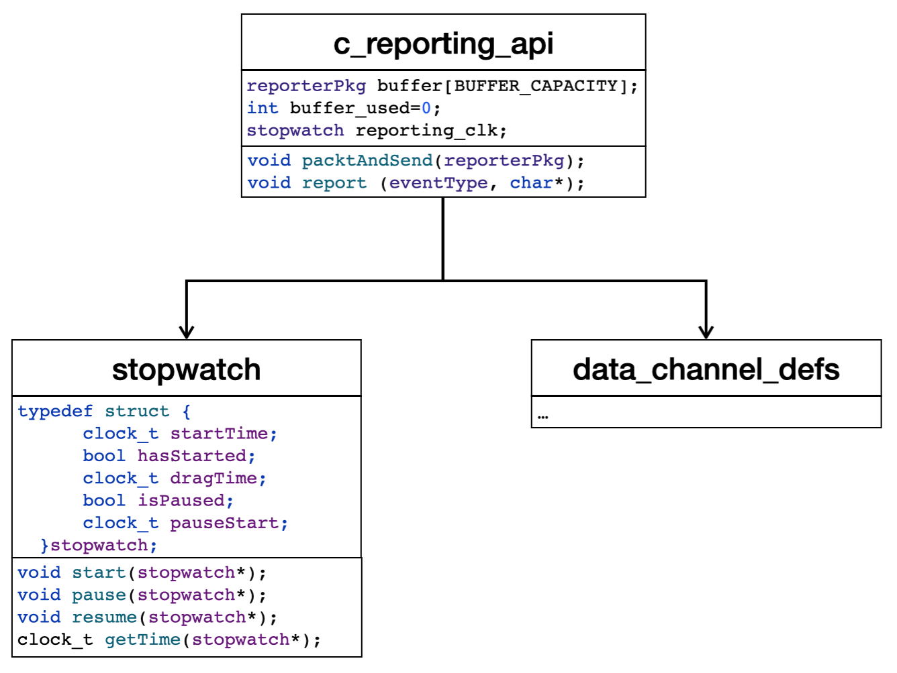

# A reporter API for C programs
This project provides a reporter API written in C, to be used in tandem with an instrumentation-based event reporting application like the [Runtime Reporter](https://github.com/invap/rt-reporter/ "The Runtime Reporter") for the runtime verification of C programs. 


## Installation
In this section we will review relevant aspects of how to setup this project for using it as a reporter API written in C for using the [Runtime Reporter](https://github.com/invap/rt-reporter/ "The Runtime Reporter") and the [Runtime Monitor](https://github.com/invap/rt-monitor/ "The Runtime Monitoring").

The implementation of the reporter library is distributed as source code to be used for instrumenting software artifacs. For obtaining it checkout the repository [c-reporter-api](https://github.com/invap/c-reporter-api/ "An implementaion of a reporter API for instrumenting software artifacts, for the use of the Runtime Reporter and the Runtime Monitor").

### Base C language installation
- gcc 11.x to gcc 12, or newer (https://gcc.gnu.org/)
- clang 14.0.0 or newer (Install via [Homebrew](https://brew.sh) with command `brew install gcc`
- MinGW (https://osdn.net/projects/mingw/)

### Structure the project
The example application project is organized as follows:
```graphql
rt-monitor-example-app/
├── bin/                       # Make will put object files here
│   ├── *c-reporter-api.o*
│   └── *stopwatch.o*
├── include/                   # Header files
│   ├── c-reporter-api.h
│   ├── data_channel_defs.h
│   └── stopwatch.h
├── lib/                       # Make will put the static libraries here
│   ├── *libc-reporter-api.a*
│   └── *libstopwatch.a*
├── README_images/             # Images the read me file
│   └── class-diagram.png
├── src/                       # Source files
│   ├── c-reporter-api.c
│   └── stopwatch.c
├── COPYING                    # Licence of the project 
├── makefile                   # Make file for building the reporting library
└── README.md                  # Read me file of the project
```


## Implementation of the reporter API
[Figure 1](#class-diagram) shows that architectural view of the implementation of the C reporting API.

<figure id="class-diagram" style="text-align: center;">
  
  <figcaption style="font-style: italic;"><b>Figure 1</b>: The architectural view of the implementation of the C reporting API.
  </figcaption>
</figure>

There, we find three main components:
1. the C reporting API (itself) [`c-reporting-api.c`](https://github.com/invap/c-reporter-api/blob/main/src/c-reporter-api.c): it is the main component of the library as it implements the function [`report`](https://github.com/invap/c-reporter-api/blob/main/src/c-reporter-api.c#L29), used by the software under test (SUT) for reporting events occurring along its execution (see Section [C reporting API component](#c-reporting-api-component) for more details).
2. the data channel definitions [`data_channel_defs.h`](https://github.com/invap/c-reporter-api/blob/main/src/data_channel_defs.h): declares the constants and data structures used for managing the communication channel that connects the SUT and the reporting application (see Section [Data channel definitions](#data-channel-definitions) for more details).
3. the Stopwatch [`stopwatch.c`](https://github.com/invap/c-reporter-api/blob/main/src/stopwatch.c): implements a stopwatch for time-stamping events (see Section [Stopwatch component](#stopwatch-component) for more details).


### C reporting API component
The C reporting API itself implement declares three global variables:
- the package buffer and a pointer to the first empty place:
```c
reporterPkg buffer[BUFFER_CAPACITY];
int buffer_used=0;
```
- a global stopwatch used for time-stamping packages:
```c
stopwatch reporting_clk;
```
And implements two functions, from which only one is supposed to be used by the SUT, `report`:
```c
void packtAndSend(reporterPkg pkg);
void report (eventType event_type, char* event);
```
The function `packtAndSend` implements buffer managing by appending packages until the buffer is full and sent through the communication channel.

The function `report` takes the event type and string passed as actual parameters and constructs the package, according to the package type, time-stamps it using the value of the global stopwatch `reporting_clk`, and process it using the function `packAndSend`.


### Data channel definitions
This component provides the definitions used for managing the communication channel between the SUT and the reporting application:
- maximum size of the buffer: 

```c
#define BUFFER_SIZE 65536
```
64K is the operating systems default.
- maximum size for a single event:
```c
//  [ INSTRUMENTACION: Define el tamano del evento más largo reportado. ]
//  [ IMPORTANTE: 0 < MAX_EVENT_SIZE <= 65528 ]
#define MAX_EVENT_SIZE (1022 + 2)
```
This line defines the maximum size for the events reported (for example, in the [example application](https://github.com/invap/rt-monitor-example-app/ "Runtime Monitor example application") accompanying this project, the longest event that is reported is 308 bytes long, plus 2 for the '\n'. It is important to note that according to this, `0 < MAX_EVENT_SIZE <= 65528` because the packages sent across the communication channel include some additional information.
- maximum size for a package containing a single event:
```c
#define MAX_EVENT_PKG_SIZE (MAX_EVENT_SIZE + 12)
```
- maximum size for a package containing a single event:
```c
#define BUFFER_CAPACITY (BUFFER_SIZE / MAX_EVENT_PKG_SIZE)
```
- package types for: 
	- time-related events (i.e., operations over clock variables like start, stop, pause, resume and reset):
	```c
	//Structure of timed_event packages
	typedef struct {
    	char data[MAX_EVENT_SIZE];
	} timedEventPkg;
	```
	- state-related (i.e., the assignment of a value to a monitored variable):
	```c
	//Structure of state_event packages
	typedef struct {
    	char data[MAX_EVENT_SIZE];
	} stateEventPkg;
	```
	- process-related events (i.e., notifications regarding the evolution of the execution like the starting/stoping of a task or the reaching of a checkpoint):
	```c
	//Structure of process_event packages
	typedef struct {
    	char data[MAX_EVENT_SIZE];
	} processEventPkg;
	```
	- component-related events (i.e., function calls):
	```c
	//Structure of component_event packages
	typedef struct {
    	char data[MAX_EVENT_SIZE];
	} componentEventPkg;
	```
	- self-loggable component events (i.e., the initiation of a log binded to a specific component and the reporting of a specific component event to be recorded in its associated event log):
	```c
	//Structure of self_loggable_component_log_init_event packages
	typedef struct {
    	char data[MAX_EVENT_SIZE];
	} selfLoggableComponentLogInitEventPkg;

	//Structure of self_loggable_component_event packages
	typedef struct {
    	char data[MAX_EVENT_SIZE];
	} selfLoggableComponentEventPkg;
	```
- the event type as an enumeration: 
```c
//classification of the different types of events
typedef enum {timed_event, state_event, process_event, component_event, self_loggable_component_log_init_event, self_loggable_component_event} eventType;
```
- the package sent across the communication channel consisting of a time-stamp, the event type and an event package corresponding to the even type:
``` c
typedef struct {
    clock_t time;
    eventType event_type;
    union {
        timedEventPkg timed_event_pkg;
        stateEventPkg state_event_pkg;
        processEventPkg process_event_pkg;
        componentEventPkg component_event_pkg;
        selfLoggableComponentLogInitEventPkg self_loggable_component_log_init_event_pkg;
        selfLoggableComponentEventPkg self_loggable_component_event_pkg;
    } event;
} reporterPkg;
```


### Stopwatch component
This component implements a simple stopwatch providing basic functionality for starting, pausing, resuming and getting the current elapsed time. 

The operation of the stopwatch relies on storing the global time, got from the system, at the moment the stopwatch is started (attribute `startTime` in the structure shown below), as a base time-stamp and then storing the accumulated time through which the stopwatch was paused  (attribute `dragTime` in the structure shown below).

The structure used to implement the stopwatch is:
```c
typedef struct {
    clock_t startTime;
    bool hasStarted;
    clock_t dragTime;
    bool isPaused;
    clock_t pauseStart;
} stopwatch;
```
The functions implementing the operation of the stopwatch are:
- `void start (stopwatch*)`: starts the stopwatch by storing the current time got from the system in the structure,
- `void pause (stopwatch*)`: pauses the stopwatch by setting the attribute `isPaused` to `true` in the structure of the stopwatch
- `void resume (stopwatch*)`: resumes the operation of the stopwatch by setting the attribute `isPaused` to `false` and adding the time through which the stopwatch was paused, to the attribute `dragTime` in the structure of the stopwatch, and
- `clock_t getTime (stopwatch*)`: returns the current time of the stopwatch by substracting the value of the attributes `startTime` and `dragTime` to the current time of the system.


## License

Copyright (c) 2024 INVAP

Copyright (c) 2024 Fundacion Sadosky

This software is licensed under the Affero General Public License (AGPL) v3. If you use this software in a non-profit context, you can use the AGPL v3 license.

If you want to include this software in a paid product or service, you must negotiate a commercial license with us.

### Benefits of dual licensing:

It allows organizations to use the software for free for non-commercial purposes.

It provides a commercial option for organizations that want to include the software in a paid product or service.

It ensures that the software remains open source and available to everyone.

### Differences between the licenses:

The AGPL v3 license requires that any modifications or derivative works be released under the same license.

The commercial license does not require that modifications or derivative works be released under the same license, but it may include additional terms and conditions.

### How to access and use the licenses:

The AGPL v3 license is available for free on our website.

The commercial license can be obtained by contacting us at info@fundacionsadosky.org.ar

### How to contribute to the free open source version:

Contributions to the free version can be submitted through GitHub.
You shall sign a DCO (Developer Certificate of Origin) for each submission from all the members of your organization. The OCD will be an option during submission at GitHub.

### How to purchase the proprietary version:

The proprietary version can be purchased by contacting us at info@fundacionsadosky.org.ar
